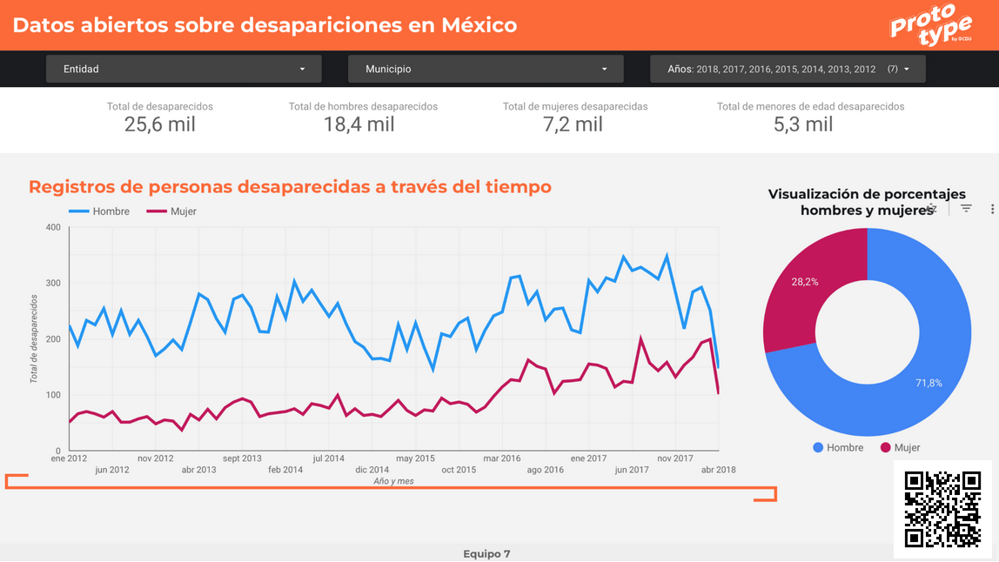
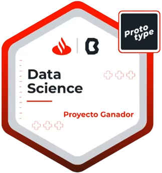

# Proyecto-de-Python-BEDU

En la actualidad, tener mayor facilidad en el acceso a las ciencias estadísticas e informáticas puede dar una visión diferente a la que se tiene. En México, la violencia y la delincuencia ocupan un espacio importante en la realidad del país, esta realidad nos afecta a todos los mexicanos.

Siempre hemos de comprender la situación tan difícil que es perder o extraviar a un ser querido o familiar. Las desapariciones causan impactos constantes en las familias, las cuales viven con el dolor de la pérdida y la incertidumbre. Cada día es más común ver a colectivos y grupos de búsqueda exigir ayuda al estado. Algunos colectivos incluso lideran procesos forenses que han ayudado a encontrar víctimas o dar resolución a los casos (Brewer, 2022). Es por esto que **se identifica como problema de alta relevancia el aumento en los casos de personas desaparecidas o no localizadas en México**. 

En el presente proyecto y con el uso del conjunto de datos del **"Registro Nacional de Datos de Personas Extraviadas o Desaparecidas"** (**RNPED**) realizaremos un análisis, limpieza y transformación de los datos mencionados, para tratar de responder las siguientes preguntas:

* **¿Existe un identificador para las personas desaparecidas?**

* **¿Cuántas personas desaparecidas son encontradas?**

* **¿En México solamente desaparecen mexicanos?**

* **¿En qué parte del país desaparecen más personas?**

* **¿Cuánto tiempo desaparecen las personas que son localizadas?**

* **¿Desaparecen más hombres, mujeres o niños?**

* **¿Cuál es el promedio de edad que tienen las personas desaparecidas?**

* **¿Existe una relación entre el sexo de la persona desaparecida con respecto al lugar de desaparición?**

* **¿En qué años han desaparecido más personas?** 

Además, por medio de modelos de Machine Learning se busca predecir la estatura de una persona, ya que posiblemente este sea el dato que se desconoce con mayor frecuencia al realizar un reporte de desaparición.

## Dashboard

El producto de nuestro trabajo a lo largo de todo el proceso formativo con BEDU se resume en un Dashboard informativo que se pone a disposición donde es posible visualizar e interactuar con los datos.

Link al Dashboard: https://datastudio.google.com/s/lB3rMIWOE3I

## Proyecto ganador del Prototype Day Data Science

Proyecto mejor calificado en el Prototype Day del programa de Data Science de Santander y BEDU.

### Colaboradores
- Jesús Manuel Jimenez Cardoza (chucho003@hotmail.com)
- Kevin Martin Rivera Castro (kevinrc.unam@gmail.com)
- Luis Mateo Patricio Pineda (mateopa@gmail.com)
- Minerva Estefanía Núñez Manjarrez (estefania.nun.man@gmail.com)
- Nicky García Fierros (nickygarcia@ciencias.unam.mx)
